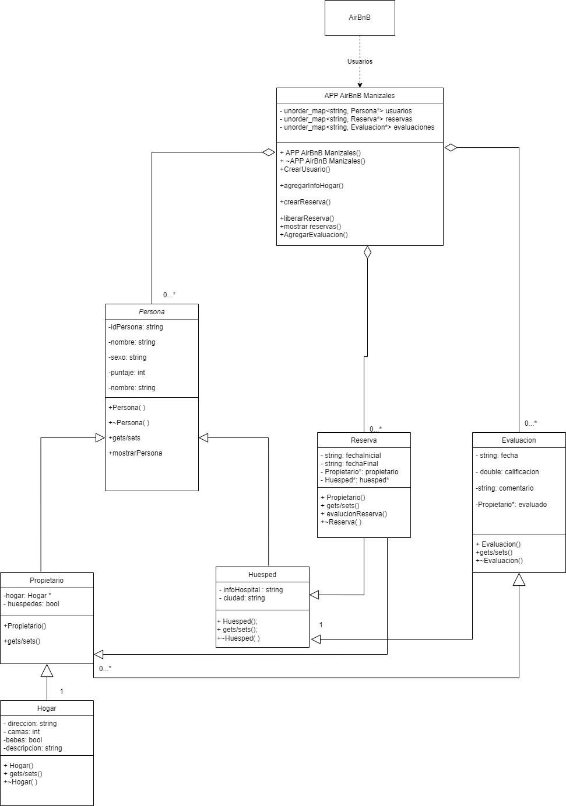

# Codificación caso de huéspedes
> Ejercicio de diseño y programación orientada a objetos con C++. 
Enunciado creado para el curso de Programación Orientada a Objetos - Pontificia Universidad Javeriana - Cali

## Enunciado 
La red de soporte de la ciudad de Manizales es una iniciativa que busca conectar personas. Por una parte se encuentran las personas de municipios y veredas que tienen que acompañar a sus familiares en alguno de los hospitales de la ciudad pero que no cuentan con familiares o con el dinero para pagar por el alojamiento.  Por otra parte, se encuentran los propietarios de viviendas de la ciudad que tienen en su hogar espacio disponible para acoger a estas personas de manera gratuita.  
Con el ánimo de ofrecer mayor seguridad para ambos tipos de personas los fundadores de la red quieren crear una aplicación que funcione como Airbnb y sirva para conectar a ambos tipos de poblaciones.  Usted ha sido encargado de elaborar un primer prototipo de esta aplicación. Para ello tenga en cuenta la siguiente información: 

Una persona puede ser un propietario o un huésped.  Tanto los propietarios como los huéspedes tienen una identificación, un nombre completo, sexo, fecha nacimiento y un puntaje. El puntaje es una herramienta de control social que sirve para que una persona demuestre su confiabilidad ante las otras personas de la red.  Este puntaje se calcula con las evaluaciones en el sistema como se explicará más adelante.

En el sistema cada propietario tendrá un hogar.  Cada hogar tiene una dirección, un número de camas disponibles, una variable para indicar si puede alojar o no bebés, un texto para describir el hogar. Además en el sistema los propietarios tendrán una variable para controlar si pueden recibir huéspedes o no.  Por su parte los huéspedes tendrán información respecto a la clínica en la que tiene el familiar cercano y su ciudad/municipio/corregimiento de origen.

Se esperan las siguientes funcionalidades para el prototipo

* El propietario puede agregar información de su hogar. 
* El sistema de propietarios tendrá la lista de personas inscritas en el sistema. 
* El sistema permitirá crear reservas. Una reserva relaciona los huéspedes con los propietarios. Para ello cada reserva tiene una fecha de inicio, fecha de fin, un propietario asociado y un huésped asociado. Cuando se crea una reserva se cambia la variable que controla la disponibilidad del propietario para indicar que estará ocupado.  
* El sistema tendrá una lista de reservas. 
* El sistema permitirá liberar reservas. Una reserva se podrá liberar cuando el huesped haya abandonado el hogar del inquilino. Liberar una reserva significa borrarla del sistema. 
* El sistema permitirá agregar evaluaciones. Cada evaluación está formada por una fecha, una calificación de 1 a 5, un mensaje de comentarios, la persona a la que se dirige y la persona que hizo la evaluación.  Cada vez que se agrega una evaluación el sistema recalcula el puntaje de la persona a la que se dirige la evaluación considerando el nuevo puntaje ( (nota anterior + nueva nota)/2 )  y actualiza su puntaje.  El sistema almacena la lista de evaluaciones. 

## Ejercicio
> Actividad en parejas
### Diseño
* Elabore el diagrama UML que represente los aspectos más importantes que requiere este enunciado para dar respuesta el ejercicio
* Complete el .README con el link al diagrama de clases y la imagen del diagrama de clases resultante. 

### Investigación
  * Investigue qué son las Actions en Github,  vaya a "Github actions", agregue un nuevo workflow que permita compilar su proyecto basado en Cmake. Configure la acción para que se ejecute cada ves que se hace push en la rama principal de su proyecto (main).
  *  Investigue qué es un LINTER [Aquí hay una primer explicación que le puede servir de referencia para comenzar](https://www.testim.io/blog/what-is-a-linter-heres-a-definition-and-quick-start-guide/). Configure una action de github actions para incorporar verificaciones de un linter para c++ cada vez que se hace un pusha al repositorio. 

### Codificación
* Codifique todas la funcionalidades propuestas en el enunciado. Tenga encuenta que:
  * Su programa debe tener menu, un main, y seguir un esquema similar a lo que hemos usado en clase
  * Su programa debe seguir el estándar de codificación camelCase. Tener nombres claros, y calidad suficientes para estudiantes que llevan casi año y medio programando.
  * De formato al código fuente y corrija los errores menores que el revisor estático de CLION detecte antes de subir su código fuente al repositorio. 
  * Modifique el .gitignore para ignorar todos los archivos de trabajo que no se deberían considerar en el proyecto
### UML

* [Link del UML](https://viewer.diagrams.net/?tags=%7B%7D&highlight=0000ff&edit=_blank&layers=1&nav=1&title=Diagrama%20sin%20t%C3%ADtulo.drawio#Uhttps%3A%2F%2Fraw.githubusercontent.com%2FSebastian-Dow%2FcasoHuespedes%2Fmain%2FDiagrama%2520sin%2520t%25C3%25ADtulo.drawio) 

  
>Todos los participantes deben participar en la codificación de este ejercicio. Es importante entonces que haya evidencia de commits provenientes de todas las partes. Los commits deben seguir el siguiente estándar:
  * *NEW*: cuando se agregan nuevas funcionaliades. 
  * *MOD*: cuando se modifican funcionalidades existentes. 
  * *FIX*: cuando se arreglan errores ya existentes. 
